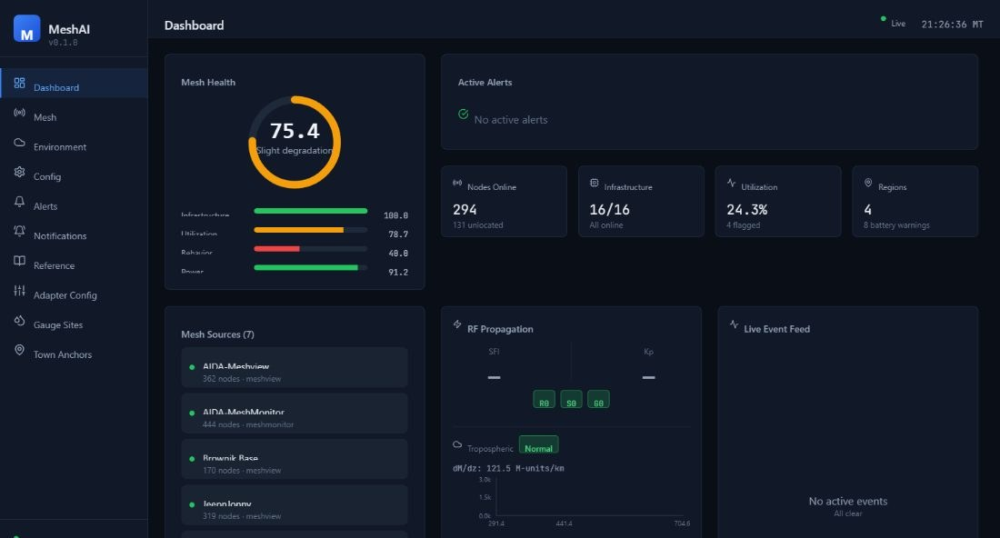
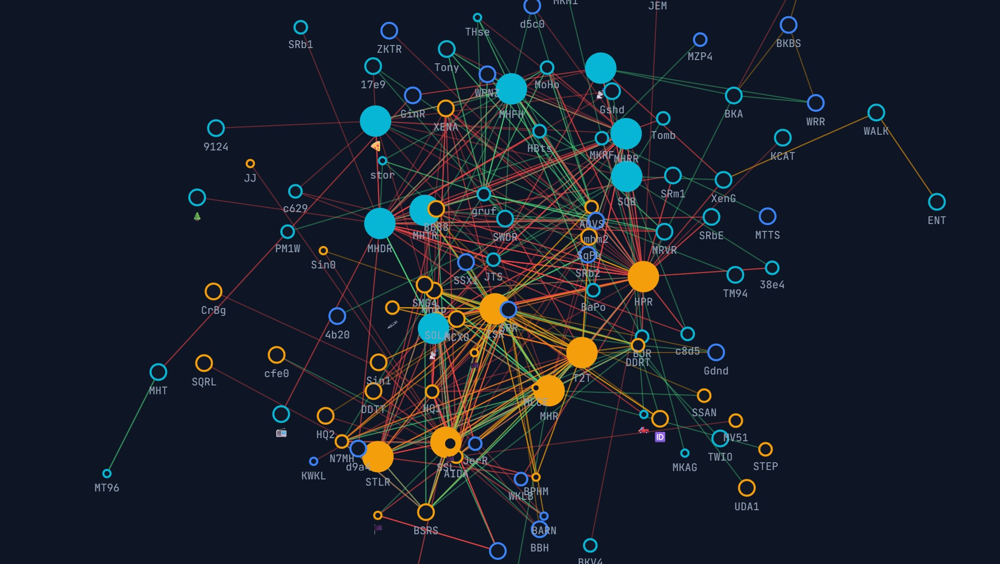
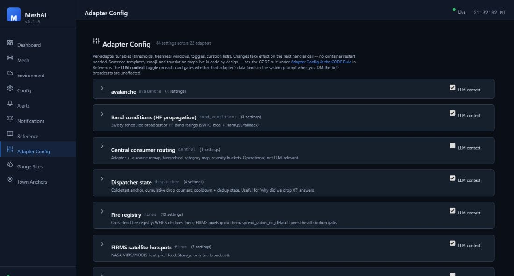

<div align="center">

# MeshAI

**LLM-powered mesh intelligence and situational-awareness assistant for Meshtastic networks.**

MeshAI joins your mesh as a physical node, continuously scores network health, watches a stack of real-time environmental feeds (weather, wildfire, earthquakes, river gauges, space weather, road conditions, avalanche), and answers questions over LoRa — backed by a full web dashboard and a configurable alert pipeline.

`Python 3.10+` · `FastAPI` · `React + Vite` · `Meshtastic` · `MIT License` · `v0.1.0`

</div>

---



> A live MeshAI deployment: a 75/100 mesh-health score, 294 nodes online, 16/16 infrastructure routers up, and seven aggregated data sources across four configured regions.

> [!IMPORTANT]
> **This is a vibe-coded project.** It was designed and built hands-on in close, iterative collaboration with AI coding tools — a real, deliberately-built solo project, not a team effort with formal QA behind it. That means it hasn't been independently security-audited, test coverage is uneven, and internal APIs can still change between commits. Read the source before you run it, don't deploy it anywhere sensitive, and use it at your own risk. Issues and PRs are welcome.

## Table of Contents

- [What MeshAI Does](#what-meshai-does)
- [The Dashboard](#the-dashboard)
- [Quick Start](#quick-start)
- [Mesh Commands](#mesh-commands)
- [Mesh Intelligence](#mesh-intelligence)
- [Environmental Feeds](#environmental-feeds)
- [Central Bus (Shared Feeds)](#central-bus-shared-feeds)
- [Notifications & Alerting](#notifications--alerting)
- [Knowledge Base (RAG)](#knowledge-base-rag)
- [Data Sources](#data-sources)
- [Dashboard API Reference](#dashboard-api-reference)
- [Configuration](#configuration)
- [LLM Backends](#llm-backends)
- [Deployment](#deployment)
- [Running Alongside Other Services](#running-alongside-other-services)
- [Architecture](#architecture)
- [Acknowledgments](#acknowledgments)

---

## What MeshAI Does

MeshAI runs as a single service attached to a Meshtastic node (TCP or serial) and combines four capabilities:

**1. Mesh intelligence.** It polls one or more [Meshview](#meshview) and [MeshMonitor](#meshmonitor) instances on a staggered schedule, builds a unified picture of every node, and computes a five-pillar health score (infrastructure, utilization, coverage, behavior, power). Ask *"how's the mesh?"* over LoRa and get a data-driven answer.

**2. Environmental awareness.** A stack of feed adapters pulls weather alerts, wildfire perimeters and satellite hotspots, earthquakes, river/stream gauges, space-weather and HF-propagation conditions, avalanche advisories, and road/work-zone closures — all geofenced to your mesh's footprint.

**3. Alerting & notifications.** A notification pipeline turns mesh and environmental conditions into broadcasts and DMs, with cold-start suppression, per-category toggles, severity gating, scaling cooldowns to prevent spam, and scheduled digests. Delivery renderers cover mesh, email (SMTP), and webhooks.

**4. Conversational LLM + knowledge.** General chat, plus optional retrieval-augmented answers from a vector knowledge base, with a self-contained local SQLite fallback. Backends: Google Gemini, OpenAI, Anthropic Claude, or any OpenAI-compatible local model.

Everything is configurable from an interactive terminal configurator **or** the web dashboard — no hardcoded geography, thresholds, or message templates.

---

## The Dashboard

The bundled React dashboard (default `http://<host>:8080/`) is the control center. Ten pages cover live monitoring and full configuration, with WebSocket push for live updates (health, alerts, environment).

### Mesh topology & geography

The **Mesh** page renders the whole network two ways. The topology view (ECharts) lays out every node by connectivity, sizes infrastructure nodes larger, and colors edges by link quality (SNR). A geographic view (Leaflet) places the same nodes and links on a real map.



> The live mesh topology: large filled circles are infrastructure (routers/repeaters), small rings are clients, and edges are colored by signal quality from green (excellent) to red (poor).

Click any node for a detail panel (role, battery, neighbors, coverage, feeder gateways, hardware). A searchable, filterable node table sits below the graph.

### Deep configurability

Beyond the basic **Config** page (bot, connection, response, history, memory, LLM, dashboard), the **Adapter Config** page exposes per-adapter tunables — thresholds, freshness windows, curation lists, and sentence templates — for every feed. Each adapter card has an *LLM context* toggle controlling whether its data is injected into the system prompt on DMs.



### All ten pages

| Page | Purpose |
|------|---------|
| **Dashboard** | Mesh health gauge, pillar scores, active alerts, node KPIs, source status |
| **Mesh** | Topology + geographic views, node table, per-node detail |
| **Environment** | Enable/configure every feed; switch feeds between `native` and `central` source |
| **Config** | Core settings: bot, connection, response, history, memory, context, LLM, dashboard |
| **Alerts** | Active alerts, filterable alert history, mesh subscriptions |
| **Notifications** | Notification rules, master toggles, scheduled digests, delivery (mesh/email/webhook) |
| **Reference** | In-app documentation (commands, broadcast types, fire tracker, CODE rule) |
| **Adapter Config** | Per-adapter thresholds, templates, and LLM-context gating |
| **Gauge Sites** | River/stream gauge editor with flood thresholds + USGS site lookup |
| **Town Anchors** | Named geographic anchors used to describe alert locations in plain language |

---

## Quick Start

### From source

```bash
git clone https://github.com/zvx-echo6/meshai.git
cd meshai

pip install -e .

meshai --config     # interactive terminal configurator
meshai              # run
```

### With Docker

```bash
mkdir -p meshai/data && cd meshai
curl -O https://raw.githubusercontent.com/zvx-echo6/meshai/main/docker-compose.yml
curl -o data/config.yaml https://raw.githubusercontent.com/zvx-echo6/meshai/main/config.example.yaml
# edit data/config.yaml, then:
docker compose up -d
```

> **Deploy note (Docker):** the Python source and dashboard bundle are baked into the image at build time — the repo is **not** bind-mounted. After any change (Python *or* frontend), rebuild: `docker compose build meshai && docker compose up -d`. A bare `restart` re-execs the old image.

The only persistent volume is `meshai_data:/data` (SQLite databases + config).

---

## Mesh Commands

Send these on the mesh (default prefix `!`). Any command can be disabled in config if another service (e.g. MeshMonitor) already handles it.

### Mesh intelligence

| Command | Aliases | Description |
|---------|---------|-------------|
| `!health` | `!mesh`, `!status` | Compact mesh health overview with status dots |
| `!region` | — | List all regions with health status |
| `!region [name]` | — | Detailed breakdown for one region |
| `!neighbors [node]` | — | Top infrastructure neighbors with signal quality |

### Subscriptions

| Command | Description |
|---------|-------------|
| `!sub daily 6pm` | Subscribe to a daily health report |
| `!sub weekly 8am sun` | Subscribe to a weekly digest |
| `!sub alerts` | Subscribe to instant alert DMs |
| `!unsub [type]` | Remove a subscription |
| `!mysubs` | List your active subscriptions |

### Environmental

| Command | Aliases | Description |
|---------|---------|-------------|
| `!alerts` | `!wx-alerts` | Active NWS weather alerts for the mesh area |
| `!fire` | — | Active wildfires (NIFC) near the mesh |
| `!hotspots [--new]` | `!satellite`, `!ignitions` | NASA FIRMS satellite fire detections (`--new` = unmatched to known fires) |
| `!avy` | `!avalanche` | Avalanche advisories (off-season aware) |
| `!streams` | — | USGS river/stream gauge readings |
| `!roads` | — | Road conditions / closures (511) |
| `!solar` | `!hf` | Space weather + HF band conditions |

### Utility

| Command | Description |
|---------|-------------|
| `!weather` | Weather for the sender's location |
| `!ping` | Liveness check |
| `!status` | Bot/system status |
| `!clear` / `!reset` | Clear your conversation history |
| `!help` / `!help [cmd]` | List commands / detailed help |

Custom static-response commands can be added in config.

### Conversational queries

You don't need commands — ask naturally over LoRa and the LLM answers from live mesh data:

- *"how's the mesh?"* → health overview with the top issues
- *"tell me about North Router"* → full node detail with neighbors, coverage, feeders
- *"where do we need more coverage?"* → named gaps with specific nodes
- *"how far is North Router from Summit Router?"* → GPS distance calculation
- *"which nodes only reach one gateway?"* → named nodes with their gateway

---

## Mesh Intelligence

MeshAI computes a weighted five-pillar health score on every refresh:

| Pillar | Weight | Measures |
|--------|:-----:|----------|
| Infrastructure | 30% | Router/repeater uptime — how many infra nodes are online |
| Utilization | 25% | Channel busyness — RF congestion across the mesh |
| Coverage | 20% | Gateway reach — how many monitoring sources see each node |
| Behavior | 15% | Traffic patterns — noisy or misconfigured nodes |
| Power | 10% | Battery health (infrastructure nodes only) |

**Health display** — `!health` returns a compact, personality-driven summary:

```
📡 Mesh 🟢 healthy
🏗️ 15/16 routers up
❌ Down: North Ridge Relay
📶 152 full coverage, 94 on thin ice
🔥 Summit Router at 21% util
🔋 All infra powered ✅
🌡️ 29-34°C across 2 sensors
North Valley 🟢 | South Valley 🟢
```

Status dots: 🔵 perfect (100) · 🟢 healthy (75+) · 🟠 warning (50+) · 🔴 critical (<50).

**Monitoring rules.** Infrastructure nodes (routers, repeaters) are tracked individually with full detail — battery, offline alerts, coverage, neighbors, hardware. Client nodes going offline is normal and is not tracked. Channel utilization and environmental sensors are monitored for all nodes.

**Geographic regions** are fully configurable — local names, descriptions, aliases, and cities, all editable from the configurator. No geography is hardcoded.

```yaml
mesh_intelligence:
  regions:
    - name: "West Region"
      local_name: "The Valley"
      description: "Primary coverage area"
      aliases: ["west region", "the valley"]
      cities: ["Springfield", "Riverton", "Fairview"]
      lat: 40.0
      lon: -111.0
      radius_km: 80
  critical_nodes: ["ROUTER-A", "ROUTER-B"]   # priority formatting when offline
  alert_channel: 0                            # broadcast channel (-1 = disabled)
```

---

## Environmental Feeds

Each feed is an independent adapter — enable only what you need. Most require no API key; the few that do are noted. Adapters geofence their data to your mesh footprint and feed both the `!commands`, the dashboard **Environment** page, and the alert pipeline.

| Feed | Source | API key | Provides |
|------|--------|:-------:|----------|
| **NWS weather alerts** | National Weather Service | — | Watches/warnings by zone, severity-filtered |
| **USGS earthquakes** | USGS FDSN | — | Quakes by magnitude floor + radius (regional/global) |
| **NIFC wildfires** | NIFC Open Data | — | Active fire perimeters, acreage, containment |
| **NASA FIRMS hotspots** | FIRMS (VIIRS/MODIS) | ✓ MAP_KEY | Satellite heat detections, cross-referenced to NIFC for new ignitions |
| **NOAA space weather** | NOAA SWPC | — | Solar/geomagnetic conditions, HF band ratings |
| **RF propagation (ducting)** | Computed | — | Tropospheric ducting from atmospheric refractivity gradient |
| **Avalanche** | Forecast centers | — | Danger-level advisories, season-aware |
| **USGS water / gauges** | USGS Water Services | — | River/stream stage + flood-threshold tracking |
| **Road conditions (511)** | State 511 / WZDx | varies | Closures, incidents, work zones |
| **Traffic** | TomTom | ✓ | Traffic incidents along configured corridors |

Example geofenced configuration:

```yaml
environmental:
  enabled: true
  nws_zones: ["XXZ001", "XXZ002"]   # your NWS public-forecast zone IDs
  nws:
    enabled: true
    severity_min: "Severe"      # Extreme | Severe | Moderate | Minor
  usgs_quake:
    enabled: true
    regional_mag_floor: 2.5
    regional_radius_mi: 300
  firms:
    enabled: true
    map_key: "your-map-key"          # https://firms.modaps.eosdis.nasa.gov/api/area/
    source: "VIIRS_SNPP_NRT"         # VIIRS_SNPP_NRT | VIIRS_NOAA20_NRT | MODIS_NRT
    day_range: 1
  usgs:
    enabled: true
    sites: ["XXXXXXXX", "XXXXXXXX"]  # USGS gauge site IDs
```

---

## Central Bus (Shared Feeds)

Every environmental adapter has a `feed_source` of either **`native`** (this node polls the upstream API itself) or **`central`** (it consumes already-normalized events from a shared **Central** bus over NATS JetStream).

This lets a fleet of MeshAI nodes share one set of upstream pulls instead of each node hammering NWS/USGS/FIRMS independently. With every adapter defaulting to `native`, the Central consumer starts as a no-op (zero subscriptions, no NATS dependency at boot); flip individual adapters to `central` from the **Environment** page to opt in.

```yaml
environmental:
  central:
    enabled: true
    url: "nats://<central-host>:4222"
    durable: "meshai-central"
    region: "<region-id>"
  nws:
    feed_source: "central"      # consume NWS from the bus instead of polling
```

---

## Notifications & Alerting

Mesh and environmental conditions flow through an event pipeline (cold-start grace → grouping → inhibition → category/severity filtering → scheduling → rendering → dispatch). Configure it all on the **Notifications** page.

### Alert conditions

Each condition is individually toggleable, with thresholds set in config or Adapter Config:

| Pillar | Condition | Default |
|--------|-----------|---------|
| Infrastructure | Router goes offline / recovers / new router appears | — |
| Infrastructure | Critical node offline (priority formatting) | per `critical_nodes` |
| Power | Battery warning / critical / emergency | <50% / <25% / <10% |
| Power | 7-day declining battery trend | >10% drop w/ rate |
| Power | USB→battery (power outage) | — |
| Power | Solar not charging during daylight | — |
| Utilization | Sustained high utilization | >20% for 6h |
| Utilization | Packet flood | >500 pkts/24h |
| Coverage | Infra drops to a single gateway | — |
| Coverage | Feeder gateway stops responding | — |
| Coverage | Region total blackout (all infra offline) | — |
| Scores | Mesh health score drop | <70/100 |
| Scores | Region health score drop | <60/100 |
| Environmental | Weather, quake, fire, ducting and other feed triggers | per adapter |

### Scaling cooldown

Alerts don't spam. When a condition fires, follow-ups stretch out — immediately, then **+12h**, **+24h**, **+48h**, then stop until it resolves. When the condition clears, one recovery notification fires and the tracker resets.

### Delivery

- **Mesh broadcast** — configurable channel index for mesh-wide visibility.
- **DM to subscribers** — users who ran `!sub alerts`, scoped to their region.
- **Email (SMTP)** and **webhook** renderers for off-mesh delivery.

### Scheduled broadcasts

Beyond reactive alerts, MeshAI ships scheduled digests — e.g. a 3×/day HF band-conditions summary and a twice-daily wildfire digest (LLM-summarized active fires + recent growth), each with its own schedule and byte budget. Master toggles on the Notifications page enable/disable whole categories (Mesh Health, Weather, Fire, RF Propagation, …) per region and channel.

---

## Knowledge Base (RAG)

MeshAI answers technical questions from a hybrid retrieval system with two interchangeable backends.

**Optional — Qdrant hybrid.** If you run a Qdrant instance with a companion text-embeddings service, MeshAI can query it over the network for hybrid dense + sparse retrieval (Reciprocal Rank Fusion). Point it at your own hosts and collection — nothing is bundled or copied.

```yaml
knowledge:
  enabled: true
  backend: auto            # qdrant | sqlite | auto (try qdrant, fall back)
  qdrant_host: "<qdrant-host>"
  qdrant_port: 6333
  qdrant_collection: "<your-collection>"
  tei_host: "<embeddings-host>"
  tei_port: 8090
  use_sparse: true
  top_k: 5
```

**Fallback — local SQLite.** With no external services, MeshAI uses a self-contained on-device SQLite KB (FTS5 keyword search + `bge-small-en-v1.5` embeddings, 384-dim). Requires `sqlite-vec` and `fastembed`. Build it from a Meshtastic ZIM export or your own documents.

```yaml
knowledge:
  enabled: true
  backend: sqlite
  db_path: /data/meshai_knowledge.db
  top_k: 5
```

---

## Data Sources

MeshAI aggregates mesh data from multiple sources using staggered, tick-based polling (one API call per 30-second tick) with built-in rate-limit protection: HTTP 429 backoff honoring `Retry-After`, exponential backoff on consecutive errors, slow-response warnings, and an optional polite mode for shared instances.

### Meshview

Unauthenticated REST. Multiple instances supported.

| Endpoint | Interval | Data |
|----------|:--------:|------|
| `/api/packets` | 30s | Near real-time packet feed |
| `/api/nodes` | 2m | Node list + metadata |
| `/api/stats` | 3m | Traffic statistics |
| `/api/edges` | 3m | Node-to-node connections |
| `/api/traceroutes` | 5m | Route data |
| `/api/packets_seen` | 10m | Per-gateway RSSI/SNR (sampled) |

### MeshMonitor

Authenticated (Bearer token). Single instance.

| Endpoint | Interval | Data |
|----------|:--------:|------|
| `/api/v1/packets` | 60s | Packet feed |
| `/api/v1/nodes` | 2m | Nodes w/ battery, utilization, hardware |
| `/api/v1/telemetry` | 2m | Environmental sensors, device metrics |
| `/api/v1/traceroutes` | 5m | Route data |
| `/api/v1/channels` | 5m | Channel configuration |
| `/api/v1/network` | 5m | Network statistics |
| `/api/v1/solar` | 10m | Solar estimates |

```yaml
mesh_sources:
  - name: "local-meshview"
    type: meshview
    url: "http://<meshview-host>:8080"
    enabled: true
  - name: "meshmonitor"
    type: meshmonitor
    url: "http://<meshmonitor-host>:3333"
    api_token: "your-bearer-token"
    enabled: true
```

An MQTT source is also supported for direct packet ingestion.

---

## Dashboard API Reference

The dashboard serves a REST API under `/api` (default port `8080`).

### Mesh & system

| Endpoint | Method | Description |
|----------|:------:|-------------|
| `/api/health` | GET | Service health check |
| `/api/status` | GET | Full system status + health scores |
| `/api/sources` | GET | Mesh source status |
| `/api/nodes` · `/api/nodes/{n}` | GET | Node list / single node detail |
| `/api/edges` | GET | Node-to-node edges |
| `/api/regions` | GET | Configured regions + scores |
| `/api/restart` | POST | Restart the service |

### Environment

| Endpoint | Method | Description |
|----------|:------:|-------------|
| `/api/env/status` | GET | Feed status summary |
| `/api/env/active` | GET | Active environmental events |
| `/api/env/swpc` · `/api/env/propagation` | GET | Space weather / HF propagation |
| `/api/env/ducting` | GET | Tropospheric ducting status |
| `/api/env/fires` · `/api/env/hotspots` | GET | Wildfires / FIRMS hotspots |
| `/api/env/avalanche` | GET | Avalanche advisories |
| `/api/env/streams` · `/api/env/usgs/lookup/{site_id}` | GET | Gauges / USGS site lookup |
| `/api/env/roads` · `/api/env/traffic` | GET | Road conditions / traffic |

### Alerts & config

| Endpoint | Method | Description |
|----------|:------:|-------------|
| `/api/alerts/active` | GET | Currently active alerts |
| `/api/alerts/history` | GET | Alert history (`?severity=&source=&limit=&offset=`) |
| `/api/subscriptions` | GET | Alert subscriptions |
| `/api/config` · `/api/config/{section}` | GET/PUT | Core configuration |
| `/api/adapter-config[/{adapter}[/{key}]]` | GET/PUT | Per-adapter settings (+ `/reset`) |
| `/api/gauge-sites` · `/api/town-anchors` | GET/POST/PUT/DELETE | Editors |
| `/api/rules` · `/api/categories` · `/api/channels` | GET/POST | Notification rules & helpers |

### WebSocket

Connect to **`/ws/live`** for push updates:

```javascript
const ws = new WebSocket('ws://<host>:8080/ws/live');
ws.onmessage = (e) => {
  const msg = JSON.parse(e.data);
  // msg.type: 'health_update' | 'alert_fired' | 'env_update'
};
```

---

## Configuration

Three ways to configure, all backed by the same store:

1. **Interactive configurator** — `meshai --config` launches a Rich-powered terminal UI covering every section.
2. **Web dashboard** — the **Config**, **Environment**, **Notifications**, and **Adapter Config** pages edit the same settings live. Most changes apply on the next handler tick; settings that need a restart surface a banner.
3. **YAML** — hand-edit `config.yaml` (see `config.example.yaml` for the fully documented template).

Message chunking keeps responses LoRa-friendly:

```yaml
response:
  max_length: 200       # max chars per message
  max_messages: 3       # messages before a continuation prompt
```

Long responses use sentence-aware splitting; command output packs multiple lines per message to minimize airtime.

---

## LLM Backends

```yaml
llm:
  backend: "google"            # google | openai | anthropic
  api_key: "your-api-key"
  model: "gemini-2.5-flash"
```

Any OpenAI-compatible endpoint works for local models — point `base_url` at it:

- **LiteLLM** — `http://localhost:4000/v1`
- **Ollama** — `http://localhost:11434/v1`
- **Open WebUI** — `http://localhost:3000/api`

Optional conversation memory keeps a rolling window and auto-summarizes older turns.

---

## Deployment

### Connection

```yaml
connection:
  type: "tcp"            # recommended
  tcp_host: "<node-ip>"
  tcp_port: 4403
```

```yaml
connection:
  type: "serial"
  serial_port: "/dev/ttyUSB0"
```

### systemd

```ini
# /etc/systemd/system/meshai.service
[Unit]
Description=MeshAI - Meshtastic Mesh Intelligence
After=network.target

[Service]
Type=simple
User=your-user
WorkingDirectory=/path/to/meshai
ExecStart=/usr/bin/python3 -m meshai
Restart=always
RestartSec=10

[Install]
WantedBy=multi-user.target
```

```bash
sudo systemctl daemon-reload
sudo systemctl enable --now meshai
```

### Docker environment variables

```bash
LLM_API_KEY=your-key-here docker compose up -d
```

---

## Running Alongside Other Services

**advBBS.** MeshAI coexists with [advBBS](https://github.com/zvx-echo6/advbbs) on the same node — BBS protocol messages (sync, RAP, mail notifications) are filtered automatically.

```yaml
bot:
  filter_bbs_protocols: true
```

**MeshMonitor.** MeshAI integrates with [MeshMonitor](https://github.com/Yeraze/meshmonitor) at two levels: it pulls MeshMonitor's auto-responder patterns to avoid duplicate replies, and uses its API as a data source (battery, telemetry, traceroutes, solar).

```yaml
meshmonitor:
  enabled: true
  url: "http://<meshmonitor-host>:8080"
  inject_into_prompt: true
  refresh_interval: 300
```

---

## Architecture

```
┌──────────────────────────────────────────────────────────────────────┐
│                                MeshAI                                  │
├──────────────────────────────────────────────────────────────────────┤
│  DATA SOURCES            INTELLIGENCE              DELIVERY            │
│  ┌────────────┐         ┌──────────────┐         ┌────────────┐       │
│  │ Meshview ×N│────┐    │ Health Engine│────────▶│  Reporter  │       │
│  │ MeshMonitor│    │    │  5-pillar    │         │  LoRa-fit  │       │
│  │ MQTT       │    ▼    │  scoring     │         └─────┬──────┘       │
│  └────────────┘ ┌───────┴──┐           │               │             │
│                 │  Data    │           │         ┌─────▼──────┐       │
│                 │  Store   │           │         │   Router   │       │
│                 │ (SQLite) │           │         │ scope/dist │       │
│                 └────┬─────┘           │         └─────┬──────┘       │
│                      │           ┌─────▼──────┐        │              │
│  ENV FEEDS      ┌────▼────┐      │    LLM     │   ┌────▼────┐         │
│  NWS/USGS/NIFC  │ Feeder  │      │  Backend   │   │ Chunker │         │
│  FIRMS/SWPC/... │ Sampling│      └────────────┘   └────┬────┘         │
│       │         └─────────┘                            │              │
│       ▼                                                │              │
│  ┌─────────────┐   ┌──────────────┐   ┌────────────┐   │              │
│  │ Central bus │   │ Notification │   │ Alert      │   │              │
│  │ (NATS, opt) │   │  Pipeline    │   │ Engine     │   │              │
│  └─────────────┘   └──────┬───────┘   └─────┬──────┘   │              │
│                           │                 │          │              │
│  KNOWLEDGE                └────────┬────────┴──────────┘              │
│  ┌─────────────┐          ┌────────▼─────────┐    ┌───────────────┐   │
│  │ Qdrant (opt)│          │    Responder     │    │   Dashboard   │   │
│  │ hybrid RAG  │          │ ACK-paced DM +   │    │ REST + /ws/live│  │
│  │ SQLite (fb) │          │ channel broadcast│    │ React UI      │   │
│  └─────────────┘          └──────────────────┘    └───────────────┘   │
└──────────────────────────────────────────────────────────────────────┘
```

---

## Acknowledgments

- [Meshtastic](https://meshtastic.org/) — the mesh networking platform
- [MeshMonitor](https://github.com/Yeraze/meshmonitor) by Yeraze — monitoring integration & data source
- [advBBS](https://github.com/zvx-echo6/advbbs) — BBS coexistence design
- [sqlite-vec](https://github.com/asg017/sqlite-vec) by Alex Garcia — vector search in SQLite
- [fastembed](https://github.com/qdrant/fastembed) by Qdrant — fast local embeddings
- [ECharts](https://echarts.apache.org/), [Leaflet](https://leafletjs.com/), [Recharts](https://recharts.org/) — dashboard visualizations

## License

MIT License

## Author

**K7ZVX** — matt@echo6.co
